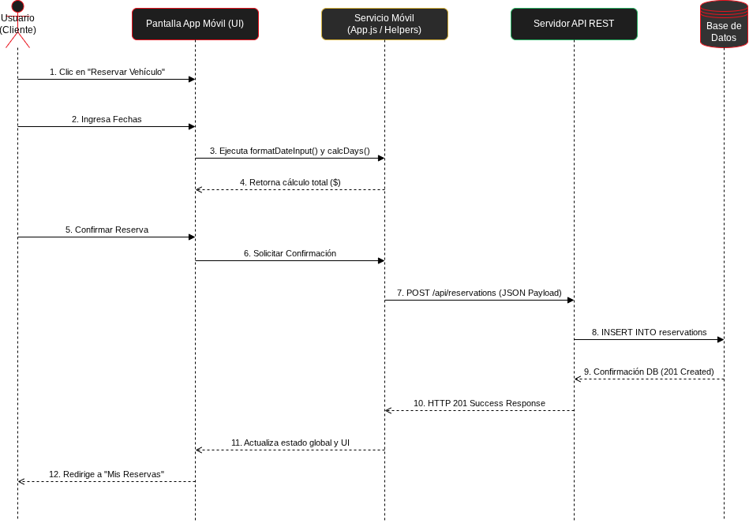

# Diagrama de Secuencia - Blackline Motor

## Descripción del Flujo
Este diagrama modela la interacción paso a paso para la funcionalidad crítica de **Reserva y Cálculo de Vehículo**, mostrando la comunicación desde la interfaz móvil hasta la persistencia en base de datos.

## Explicación de los Pasos

1. **Selección de Vehículo:** El usuario presiona el botón "Reservar" desde el detalle de la tarjeta (`VehicleCard` / `PremiumCard`).
2. **Ingreso y Formato de Fechas:** La vista solicita el rango de fechas. El controlador ejecuta `formatDateInput` para asegurar la estructura `DD/MM/AAAA`.
3. **Cálculo Dinámico:** Se llama a la función helper `calcDays` que calcula los días de estancia y multiplica por la tarifa por día del vehículo seleccionado, mostrando el total en pantalla en tiempo real.
4. **Confirmación:** El cliente presiona "Confirmar Reserva" para enviar los datos.
5. **Petición HTTP:** La aplicación realiza un requerimiento `POST` a `/api/reservations` adjuntando el token de sesión y el objeto de la reserva.
6. **Validación e Inserción:** El servidor API REST valida el estado del usuario, verifica la disponibilidad e inserta el registro en la Base de Datos.
7. **Respuesta y Reactividad:** El servidor responde con código `201 Created`. El controlador actualiza la variable global `reservations` y la interfaz re-renderiza la pantalla "Mis Reservas" mostrando el nuevo vehículo reservado.